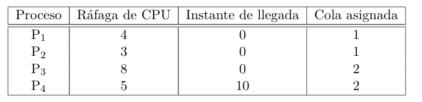

## a) 
| Tiempo   |  0  |  1  |  2  |  3  |  4  |  5  |  6  |  7  |  8  |  9  | 10  | 11  | 12  | 13  | 14  | 15  | 16  | 17  | 18  | 19  |
|----------|-----|-----|-----|-----|-----|-----|-----|-----|-----|-----|-----|-----|-----|-----|-----|-----|-----|-----|-----|-----|
| Proceso  | P1  | P2  | P1  | P2  | P1  | P2* | P1* | P3  | P3  | P3  | P3  | P3  | P3  | P3  | P3* | P4  | P4  | P4  | P4  | P4* |

- Llegan P1, P2 y P3 en t=0. P1 y P2 van a la cola de prioridad 1, P3 a la 2.
- Ejecuta la cola 1 con RR (q=1) durante 7 ms (la suma de los tiempos de P1 y P2).
- En t=5 termina P2.
- En t=6 termina P3 (la suma de P1 y P2).
- En t=7 comienza a ejecutar la cola 2 con FCFS, comienza P3 (de hecho es el unico que hay).
- En t=10 llega P4 a la cola 2.
- En t=14 termina P3 y comienza P4
- En t=19 termina P4.

## b)
$$
\text{Waiting time promedio} = \frac{3 + 3 + 7 + 5}{4} = 4.5
$$
$$
\text{Turnaround promedio} = \frac{7 + 6 + 15 + 10}{4} = 9.55
$$