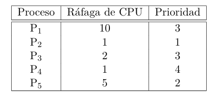

Los procesos llegan en el orden P1, P2, P3, P4, P5 en el tiempo 0.

## FCFS (FIFO)
| Tiempo   |  0  |  1  |  2  |  3  |  4  |  5  |  6  |  7  |  8  |  9  | 10  | 11  | 12  | 13  | 14  | 15  | 16  | 17  | 18  |
|----------|-----|-----|-----|-----|-----|-----|-----|-----|-----|-----|-----|-----|-----|-----|-----|-----|-----|-----|-----|
| Proceso  | P1  | P1  | P1  | P1  | P1  | P1  | P1  | P1  | P1  | P1  | P2  | P3  | P3  | P4  | P5  | P5  | P5  | P5  | P5  |

$$
\text{Waiting time promedio} = \frac{0 + 10 + 11 + 13 + 14}{5} = 9.6
$$
$$
\text{Turnaround promedio} = \frac{10 + 11 + 13 + 14 + 19}{5} = 13.4
$$

## SJF (Shortest Job First)

| Tiempo   |  0  |  1  |  2  |  3  |  4  |  5  |  6  |  7  |  8  |  9  | 10  | 11  | 12  | 13  | 14  | 15  | 16  | 17  | 18  |
|----------|-----|-----|-----|-----|-----|-----|-----|-----|-----|-----|-----|-----|-----|-----|-----|-----|-----|-----|-----|
| Proceso  | P2* | P4* | P3  | P3  | P5  | P5  | P5  | P5  | P5  | P1  | P1  | P1  | P1  | P1  | P1  | P1  | P1  | P1  | P1  |

* P2 y P4 pueden intercambiarse, tienen el mismo tiempo de CPU (1 unidad)

$$
\text{Waiting time promedio} = \frac{9 + 0 + 2 + 1 + 4}{5} = 3.2
$$
$$
\text{Turnaround promedio} = \frac{19 + 1 + 4 + 2 + 9}{5} = 7
$$

## Prioridades sin desalojo (a menor numero, mayor prioridad)

| Tiempo   |  0  |  1  |  2  |  3  |  4  |  5  |  6  |  7  |  8  |  9  | 10  | 11  | 12  | 13  | 14  | 15  | 16  | 17  | 18  |
|----------|-----|-----|-----|-----|-----|-----|-----|-----|-----|-----|-----|-----|-----|-----|-----|-----|-----|-----|-----|
| Proceso  | P2  | P5  | P5  | P5  | P5  | P5  | P1  | P1  | P1  | P1  | P1  | P1  | P1  | P1  | P1  | P1  | P3  | P3  | P4  |

P1 y P3 pueden intercambiarse, tienen la misma prioridad (3)
$$
\text{Waiting time promedio} = \frac{6 + 0 + 16 + 18 + 1}{5} = 8.2
$$
$$
\text{Turnaround promedio} = \frac{16 + 1 + 18 + 19 + 6}{5} = 12
$$

## Round Robin (quantum = 1 y ordenados por numero de proceso)

| Tiempo   |  0  |  1  |  2  |  3  |  4  |  5  |  6  |  7  |  8  |  9  | 10  | 11  | 12  | 13  | 14  | 15  | 16  | 17  | 18  |
|----------|-----|-----|-----|-----|-----|-----|-----|-----|-----|-----|-----|-----|-----|-----|-----|-----|-----|-----|-----|
| Proceso  | P1  | P2* | P3  | P4* | P5  | P1  | P3* | P5  | P1  | P5  | P1  | P5  | P1  | P5* | P1  | P1  | P1  | P1  | P1* |

(* indica que el proceso termina en ese ciclo)
$$
\text{Waiting time promedio} = \frac{9 + 1 + 5 + 3 + 9}{5} = 5.4
$$
$$
\text{Turnaround promedio} = \frac{19 + 2 + 7 + 4 + 14}{5} = 9.2
$$

# Conclusiones

El orden en waiting time promedio es SJF < RR < Prioridades < FIFO

El orden en turnaround time promedio es SJF < RR < Prioridades < FIFO