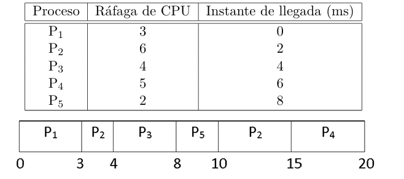

## a)
$$
\text{Waiting time promedio} = \frac{0 + 7 + 0 + 9 + 0}{5} = 3.2
$$
$$
\text{Turnaround promedio} = \frac{3 + 13 + 4 + 14 + 2}{5} = 7.2
$$

## b) 
Corresponde a un scheduler **Shortest Remaining Time First (SRTF)**.  
- Tiempo 0: Llega P1 y ejecuta.
- Tiempo 2: LLega P2 pero no lo interrumpe pues tiene mayor tiempo de ejecucion.
Tiempo 3: Termina P1 y ejecuta P2.
- Tiempo 4: Llega P3 y lo ejecuta pues tiene menor tiempo de ejecucion que P2.
- Tiempo 6: Llega P4 pero no lo interrumpe pues tiene mayor tiempo de ejecucion.
- Tiempo 8: Termina P3 y llega P5. Ejecuta P5 pues tiene menor tiempo que P2 y P4.
- Tiempo 10: Termina P5 y ejecuta P2 pues tiene igual tiempo que P4 (P2 ya habia ejecutado 1 ms asique le restan 4).
- Tiempo 15: Termina P2 y ejecuta P4.
- Tiempo 20: Termina P4.

