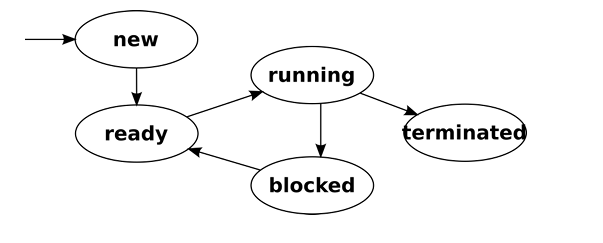

El scheduler es nonpreemptive/cooperativo pues nunca desaloja un proceso por la fuerza (al no haber flecha de running a ready).  
El proceso en ejecucion tiene la CPU hasta que termine o hasta que se bloquee esperando E/S.