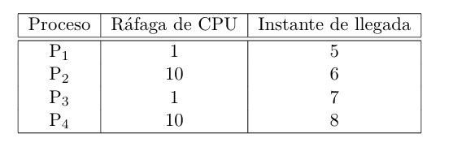

## FCFS (FIFO)
 
| Tiempo   |  0  |  1  |  2  |  3  |  4  |  5  |  6  |  7  |  8  |  9  | 10  | 11  | 12  | 13  | 14  | 15  | 16  | 17  | 18  | 19  | 20  | 21  | 22  | 23  | 24  | 25  | 26  |
|----------|-----|-----|-----|-----|-----|-----|-----|-----|-----|-----|-----|-----|-----|-----|-----|-----|-----|-----|-----|-----|-----|-----|-----|-----|-----|-----|-----|
| Proceso  | - | - | - | - | - | P1* | P2  | P2  | P2  | P2  | P2  | P2  | P2  | P2  | P2  | P2* | P3* | P4  | P4  | P4  | P4  | P4  | P4  | P4  | P4  | P4  | P4*  |

* Indica que terminó el proceso
$$
\text{Waiting time promedio} = \frac{0 + 0 + 9 + 9}{4} = 4.5
$$
$$
\text{Turnaround promedio} = \frac{1 + 10 + 9 + 18}{4} = 9.5
$$

## Round Robin (quantum = 10)

| Tiempo   |  0  |  1  |  2  |  3  |  4  |  5  |  6  |  7  |  8  |  9  | 10  | 11  | 12  | 13  | 14  | 15  | 16  | 17  | 18  | 19  | 20  | 21  | 22  | 23  | 24  | 25  | 26  |
|----------|-----|-----|-----|-----|-----|-----|-----|-----|-----|-----|-----|-----|-----|-----|-----|-----|-----|-----|-----|-----|-----|-----|-----|-----|-----|-----|-----|
| Proceso  | - | - | - | - | - | P1* | P2  | P2  | P2  | P2  | P2  | P2  | P2  | P2  | P2  | P2* | P3* | P4  | P4  | P4  | P4  | P4  | P4  | P4  | P4  | P4  | P4*  |

$$
\text{Waiting time promedio} = \frac{0 + 0 + 9 + 9}{4} = 4.5
$$
$$
\text{Turnaround promedio} = \frac{1 + 10 + 9 + 18}{4} = 9.5
$$

## SJF (Shortest Job First)

| Tiempo   |  0  |  1  |  2  |  3  |  4  |  5  |  6  |  7  |  8  |  9  | 10  | 11  | 12  | 13  | 14  | 15  | 16  | 17  | 18  | 19  | 20  | 21  | 22  | 23  | 24  | 25  | 26  |
|----------|-----|-----|-----|-----|-----|-----|-----|-----|-----|-----|-----|-----|-----|-----|-----|-----|-----|-----|-----|-----|-----|-----|-----|-----|-----|-----|-----|
| Proceso  | - | - | - | - | - | P1* | P2  | P2  | P2  | P2  | P2  | P2  | P2  | P2  | P2  | P2* | P3* | P4  | P4  | P4  | P4  | P4  | P4  | P4  | P4  | P4  | P4*  |

$$
\text{Waiting time promedio} = \frac{0 + 0 + 9 + 9}{4} = 4.5
$$
$$
\text{Turnaround promedio} = \frac{1 + 10 + 9 + 18}{4} = 9.5
$$

Notar que por mas que en T=7 llegué P3 y es mas corto que P2, no puedo interrumpir a P2 porque SJF no es con desalojo.