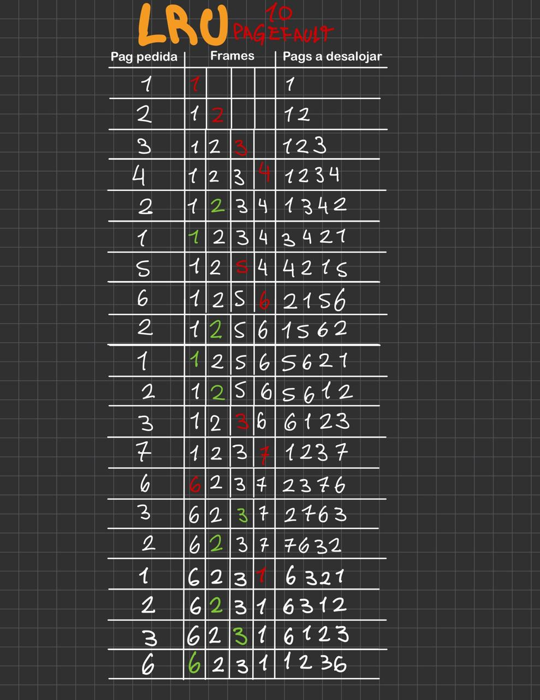

 1, 2, 3, 4, 2, 1, 5, 6, 2, 1, 2, 3, 7, 6, 3, 2, 1, 2, 3, 6

## Casos borde
- Con 7 frames solo habrá page_fault la primera vez que se cargue una pagina, luego todas las paginas estarán en memoria y no habrá más page_faults. 7 page_faults.
- Con 1 frame habrá page_fault siempre ya que siempre se intenta acceder a una pagina distinta a la que está en el frame. 20 page_faults.

## 4 frames

### a) LRU

## b) FIFO

## c) Second Chance
