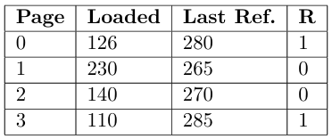

### a) FIFO
Desalojará el proceso 3 pues es el que lleva más tiempo en memoria.

## b) LRU
Desalojará el proceso 1 pues es el que no es referenciado hace más tiempo.

## c) Second Chance
Desalojará el proceso 2 pues es el que más lleva en memoria entre los que no fueron referenciados desde la última vez que usaron su second chance.