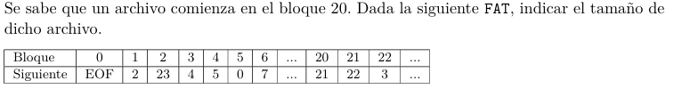

# Ejercicio 2
- Disk size: 128 GB
- Block size: 8 KB
- FAT entry size: 24 B

### a) Tamaño de la tabla FAT
1 KB = 2^10  y 8 = 2^3 --> 8 KB = 2^13  
1 MB = 2^20  
1 GB = 2^30  y 128 = 2^7 --> 128 GB = 2^37  
 

Hay 128 GB / 8 KB = 2^24 bloques.  
La FAT tiene una entry por bloque, por lo que su tamaño será 2^24 * 24 = 2^20 * 2^4 * 24 = 1 MB * 384 = 384 MB

### b) Cuantos archivos de 10 MB es posible almacenar?
Primero hay que ver cuantos bloques ocupa un archivo de 10 MB:  
10 MB / 8 KB = 1,25 KB = 1280 bloques por archivo.  
Soportamos 2^24 bloques, por lo que la cantidad de archivos de 10 MB que entran es:  
floor(2^24 / 1280) = 13.107 

### c)

Bloques del archivo: 20, 21, 22, 3, 4, 5, 0
El archivo tiene 7 bloques y cada bloque tiene tamaño = 8 KB.  
Sin embargo, el archivo podria no usar la totalidad del ultimo bloque, por lo que pesa entre 48 KB y 56 KB.